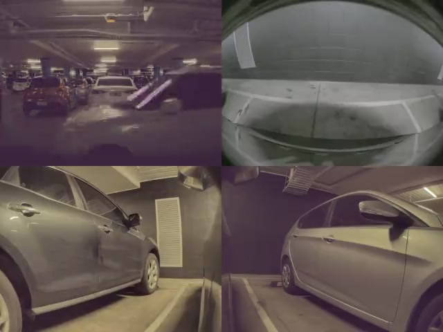

# Tesla Sentry Video

Stack all camera views into a single video for simpler review.



[feel free to use my referral code](https://ts.la/helen94378)

# Examples

## make stacked versions of all sentry events

With these settings the output video is usually less than 100 kB.

```
$ cd SentryEvents
$ sentry_stack.py --scale 4 --speed 8 --quality 30
```

Otherwise you can use `--sentry-dir` to tell `sentry_stack` where to find the sentry videos.

## show help

```
$ sentry_stack.py --help
usage: sentry_stack.py [-h] [--sentry-dir SENTRY_DIR] [--speed SPEED]
                       [--scale SCALE] [--quality QUALITY] [--overwrite]
                       [--dry-run] [--list-dir]

Stack your Tesla model3 sentry videos into a single output. WARNING: any
arguments not explicitly recognized are considered global options which are
added to the command line immediately after ffmpeg. Consider using the --dry-
run argument and also inspect the logs for 'global options', if this list is
not empty then proceed with caution.

optional arguments:
  -h, --help            show this help message and exit
  --sentry-dir SENTRY_DIR
                        Top level Sentry dir (./)
  --speed SPEED         int speed multiplier (1).
  --scale SCALE         scale down multiplier (4). Eg set to 2 for half the
                        width/height.
  --quality QUALITY     encode quality (23). Increase this to reduce quality
                        and filesize.
  --overwrite           Silently overwrite output file, otherwise skip.
  --dry-run             print commands but do not execute. Note this is for
                        information only, you may need to tweak the escaping.
  --list-dir            list sub directories which correspond to Tesla sentry
                        events.
```

